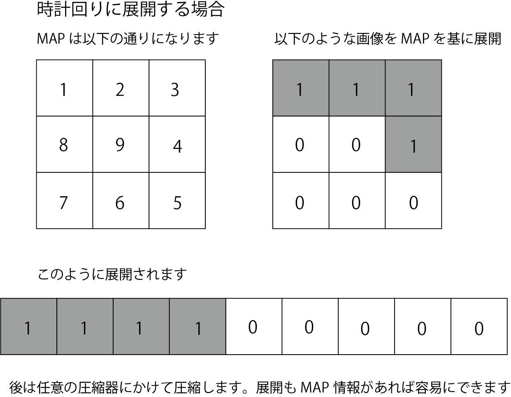

## 想定されるフロー

- 画像を読み込む
- どのMAPを用いるか決める
- 画像をMAPで展開
- エンコーダでエンコード
- MAP番号とエンコードされた情報をくっつける

- 圧縮されたデータから、MAP番号を取り出す
- 残ったデータをデコーダにかける
- MAP番号から該当MAPをとりだし、画像にする

## エンコーダを叩く時

```
python3 encode.py TMW/camera.pgm encoded default
↑最後の引数でエンコーダのバージョンを指定する
```

## デコーダを叩く時
```
python3 dedcode.py encoded decoded.png default
こちらも同様に最後にエンコーダのバージョンを指定する
```

## MAPについて

画像の特徴を捉えて圧縮率を向上させる方法として、MAPを作成することを考えた。チームとして活用するかはまだ検討中であるが、個人で運用してみて使用感がよければチーム開発に移植する


